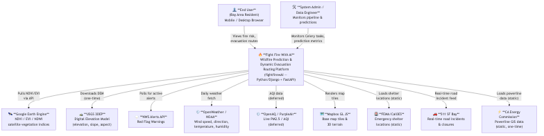
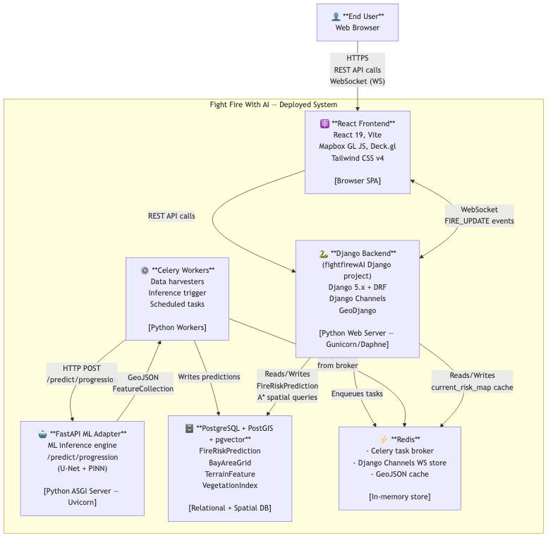
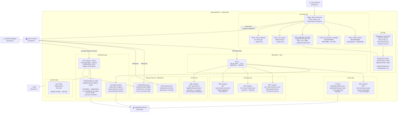
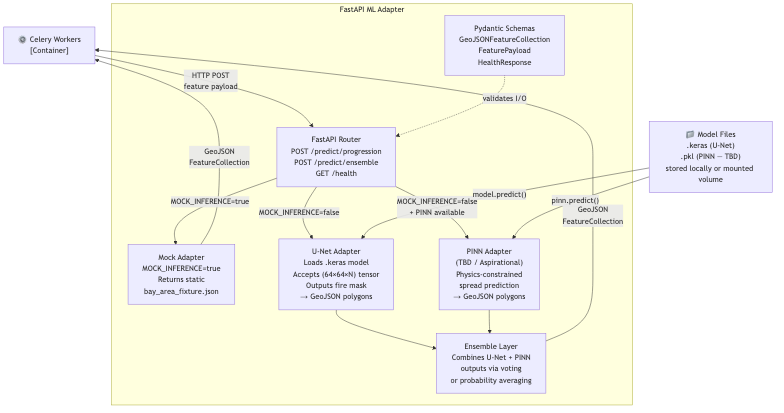
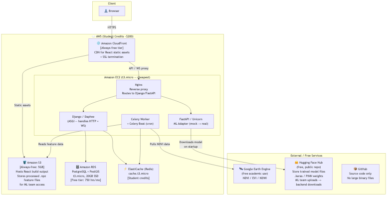

# Fight Fire With AI — C4 Architecture Diagrams

> Following the C4 model: **Context → Containers → Components**. Code level omitted per project scope.

---

## Level 1 — System Context Diagram

*Who uses the system and what external systems does it interact with?*

---

## Level 2 — Container Diagram

*What are the deployable units and how do they talk to each other?*

---

## Level 3 — Component Diagram: Django Backend

*What are the internal components of the Django backend container?*

---

## Level 3 — Component Diagram: FastAPI ML Adapter

---

## Cloud Architecture Diagram (Student Budget)

*Recommended AWS deployment using student-tier credits + always-free services.*

---

## Data Storage Decision Guide

| Data Type | Size Estimate | Recommended Storage | Cost |
|---|---|---|---|
| **React build** | ~5 MB | AWS S3 | Free tier |
| **Processed `.npz` feature files** (daily, Bay Area) | ~100–500 MB/day | AWS S3 | ~\$0.023/GB/mo |
| **PostGIS spatial data** (grid, terrain, predictions) | ~2–5 GB | AWS RDS | Free tier (20GB) |
| **Trained U-Net `.keras` model** | ~50–200 MB | **Hugging Face Hub** | Free (public repo) |
| **PINN model weights** | ~10–50 MB | **Hugging Face Hub** | Free |
| **Raw satellite imagery** (Landsat, GOES) | **Terabytes** | **Google Earth Engine** — do NOT download | Free academic |
| **Historical fire perimeters** (CAL FIRE FRAP) | ~1 GB | AWS S3 or local | Minimal |
| **USGS DEM** (Bay Area) | ~2 GB | AWS S3 or local | Minimal |

> [!IMPORTANT]
> **Key recommendation**: Never download raw satellite imagery to your own storage. Use **Google Earth Engine** (free for academic use) to query, process, and extract only the computed indices (NDVI, EVI) you need. This avoids terabytes of storage costs.

> [!TIP]
> **Hugging Face Hub for model files**: The ML team uploads trained model files to a Hugging Face repo → the FastAPI ML Adapter downloads the latest model on container startup. Zero storage cost, zero coordination overhead.

---

## Open Questions Before Week 1 Scaffold

| Question | Decision |
|---|---|
| Grid resolution | **1×1 km** (18,000 cells, aligns with papers — revisit 0.5km later) |
| Django project name | **`fightfirewAI`** |
| Python version | **Python 3.12** (stable LTS, most Django/TF support) |
| Google Colab / Drive | **Deferred** — use GEE + Hugging Face Hub instead |
| RAG chatbot | **Deferred** — out of scope until core features work |
| XGBoost/RF in FastAPI | **Removed** — not needed for now |
